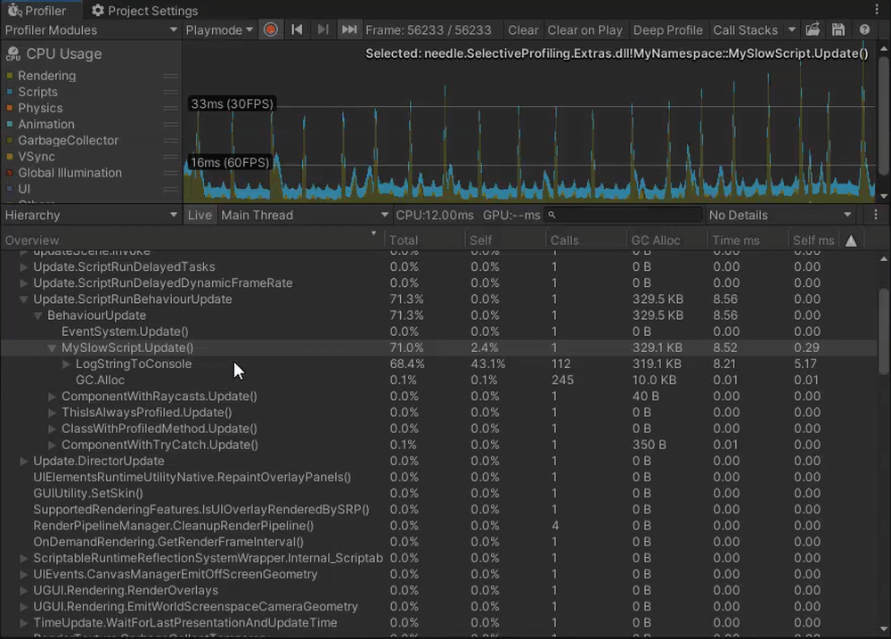

# Selective Profiling for Unity
## Runtime deep profile individual methods 🔬


With selective profiler you can choose individual methods to profile from Unity Profiler. Just select a method in the Profiler window and choose ``Profile`` to automatically get more precice information.

## Features 🧬
- ### Select methods in the Unity Profiler to start or stop deep profiling, at any time! No domain reload or restart needed. 

  

- ### Mark methods or classes in your project to be always deep profiled without having to turn on Deep Profiling for your whole project.


---


## Installation 💾
1) 
    <details>
    <summary>Clone this repository and add OpenUPM to your project</em></summary>

    To add OpenUPM to your project:

    - open `Edit/Project Settings/Package Manager`
    - add a new Scoped Registry:
    ```
    Name: OpenUPM
    URL:  https://package.openupm.com/
    Scope(s): com.needle
    ```
    - click <kbd>Save</kbd>
    </details>

2) Add the folder named "package" to your project in Package Manager via local file path ``"com.needle.selective-profiling": "file:path/to/cloned/repo/package"``). 
3) That's it. Now you should be able to right click methods in profiler to add samples. You can find settings under ``Project Settings/Needle/Selective Profiler``

## How To Use 💡
Please open the <a href="https://github.com/needle-tools/selective-profiling/blob/main/package/Readme.md">Package Readme</a> for more information.

## Contact ✒️
<b>[🌵 needle — tools for unity](https://needle.tools)</b> • 
[@NeedleTools](https://twitter.com/NeedleTools) • 
[@marcel_wiessler](https://twitter.com/marcel_wiessler) • 
[@hybridherbst](https://twitter.com/hybridherbst) • 
[Needle Discord](https://discord.gg/CFZDp4b)

