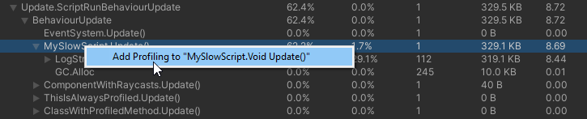

# Selective Profiling for Unity
## Runtime deep profile individual methods 🔬

With selective profiler you can choose individual methods to profile from Unity Profiler. Just select a method in the Profiler window and choose ``Profile`` to automatically get more precice information.

## Features 🧬
- ### Select methods in the Unity Profiler to start or stop deep profiling, at any time! No domain reload or restart needed. 
- ### Mark methods or classes in your project to be always deep profiled without having to turn on Deep Profiling for your whole project.

  https://user-images.githubusercontent.com/5083203/174031025-ebc94e6c-f8fc-4589-a945-67e0a4574bae.mp4

---

## How To Use 💡
Please open the <a href="https://github.com/needle-tools/selective-profiling/blob/main/package/Readme.md">Package Readme</a> for more information.

## Contact ✒️
<b>[🌵 needle — tools for unity](https://needle.tools)</b> • 
[@NeedleTools](https://twitter.com/NeedleTools) • 
[@marcel_wiessler](https://twitter.com/marcel_wiessler) • 
[@hybridherbst](https://twitter.com/hybridherbst) • 
[Needle Discord](https://discord.gg/CFZDp4b)

