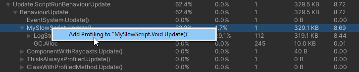
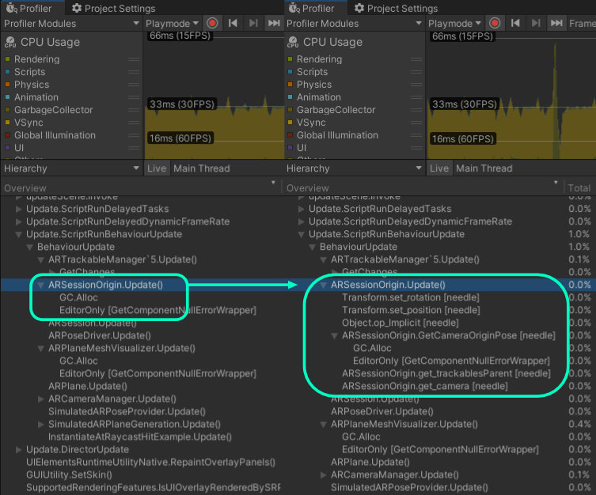
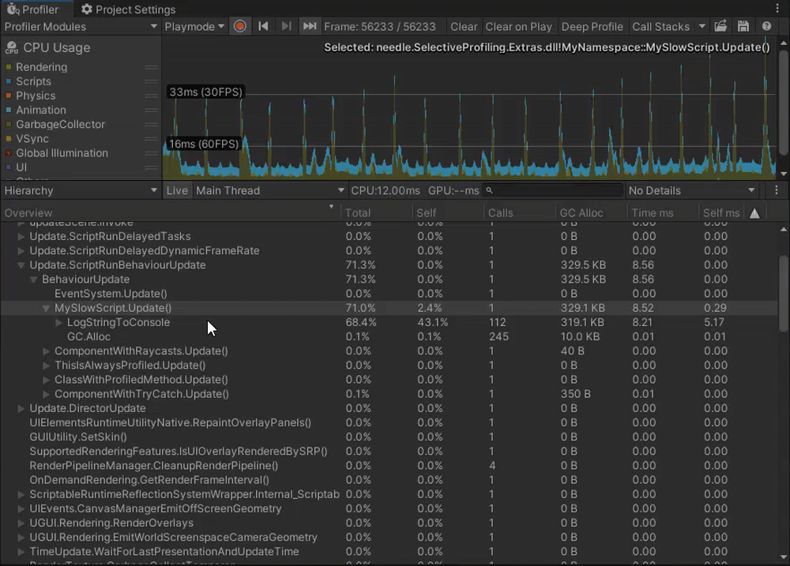

# Selective Profiling for Unity
## Runtime deep profile individual methods 🔬
With selective profiler you can choose individual methods to profile from Unity Profiler. Just select a method in the Profiler window and choose ``Profile`` to automatically get more precice information.







## Features 🧬
- ### Select methods in the Unity Profiler to start or stop deep profiling, at any time! No domain reload or restart needed. 
- ### Slow method calls or calls producing a lot of garbage are color coded
- ### Deeply nested hierarchies can be collapsed (e.g. collapsing internal editor calls)
- ### Method call markers can be rendered in the graph view (experimental, needs UI)
- ### Mark methods or classes in your project with ``[AlwaysProfile]`` to be always deep profiled without having to turn on Deep Profiling for your whole project or selecting specific methods.



## Installation 💾
1)  Add OpenUPM to your project:

    To add OpenUPM to your project:

    - open `Edit/Project Settings/Package Manager`
    - add a new Scoped Registry:
    ```
    Name: OpenUPM
    URL:  https://package.openupm.com/
    Scope(s): com.needle
    ```
    - click <kbd>Save</kbd>

2) Open Window/PackageManager, select "My Registries" in top left corner, find and select "Selective Profiler" and click <kbd>Install</kbd> 
3) That's it. Now you should be able to right click methods in profiler to add samples. You can find settings under ``Project Settings/Needle/Selective Profiler``

## How to use 💡
- ### How to select a method to profile
  1) You can right click a method in the profiler and enable or disable profiling
  2) You can right click a component in the inspector and select ``Profile/...`` for profiling options
  3) You can rigth click a gameobject in the hierarchy to profile all the user methods found in the hierarchy

  **NOTE**: when selecting methods in edit mode they will be saved to the selected methods list. Selected methods in playmode will not be saved.
  
- ### How to remove previously saved methods
  At edit time you right click methods in the profiler window to enable or disable profiling them.
  Generally to see what is currently saved open ``Project Settings/Needle/Selective Profiler``. In the settings window you can see an overview of all saved methods. You can remove a method completely by clicking the X or to mute a method disable the toggle which means it will not be profiled and if deep profiling is enabled and other method call this method it will be skipped.
  
- ### How to always deep profile classes or methods?
   Just add a ``[AlwaysProfile]`` attribute to your class or method you want to profile

## Technical background 💉
Internally when a method gets selected for profiling we wrap every call instruction inside that selected method with ``Profiler.Begin`` and ``End`` calls. **The resulting output is the same as if you would have added those calls manually in your code!**

For injection we use [Harmony](https://github.com/pardeike/Harmony), an awesome library by Andreas Pardeike. Harmony allows to modify almost any code at runtime by modifying the underlying IL instructions. Those modifications are only in memory and dont affect your C# code or built Unity game/player.

## Known issues / limitations 😰
- Generic classes or methods are currently not supported. [See issue](https://github.com/needle-tools/selective-profiling/issues/6)
- Occasionally injections break method functionality or cause errors ([see issue](https://github.com/needle-tools/selective-profiling/issues/2)). It seems to only happen with properties though. Profiling code inside properties should not be important and therefore it is disabled by default (See setting ``Skip Properties``). Otherwise it is recommended to try disabling the ``Deep Profile`` option in ``Project Settings/Needle/Selective Profiling`` or decreasing the ``Max Level``. In any case please also [open an issue](https://github.com/needle-tools/selective-profiling/issues/new) with as much information about your project and profiled method as possible to help us find and fix issues like that.
- ECS samples using a combination ``unsafe partial struct`` can apparently not be patched correctly [see issue 16](https://github.com/needle-tools/selective-profiling/issues/16)

## Contribution
- This project is open for contributions!  
  There are a couple of things missing, for example: UI for marking methods to be displayed in the Profiler graph view.

## Contact ✒️
<b>[🌵 needle — tools for unity](https://needle.tools)</b> • 
[@NeedleTools](https://twitter.com/NeedleTools) • 
[@marcel_wiessler](https://twitter.com/marcel_wiessler) • 
[@hybridherbst](https://twitter.com/hybridherbst) • 
[Needle Discord](https://discord.gg/CFZDp4b)

